# Software purpose

Go Review Partner ("GRP") is a tool to help you analyze and review your games of go (weiqi, baduk) using bots.

GRP is not yet another SGF editor, it won't allow you to view or modify (adding variations or comments) an existing SGF file.

Instead, it takes one existing SGF file and "feeds it" to a bot (currently, [GnuGo](https://www.gnu.org/software/gnugo/), [Leela](https://www.sjeng.org/leela.html), [Ray](https://github.com/zakki/Ray), [AQ](https://github.com/ymgaq/AQ) and [Leela Zero](https://github.com/gcp/leela-zero) are supported) then has the bot give its "opinion" on the best moves to play for each game position.

Additionally, GRP proposes a nice interface to review all that data.

There exist 2 other applications that can be used to perform analysis of SGF file using Leela Zero:

+ [Leela Sabaki](https://github.com/SabakiHQ/LeelaSabaki) is closer to a normal SGF editor,
+ [Lizzie](https://github.com/featurecat/lizzie) can be used to perform analysis of a given position, in a very interactive way.

Both projects are cool, and you should definitively have a try as well.
GRP differs from those projects in that it performs the analysis of a complete game record in one shot, automatically. In this regard, it can be used on old or slow computers to analyze your game when you are not at your computer (during the night, or during working hours), saving the analysis result for when you have time to review it.
Also, GRP does not limit itself to Leela Zero, and aims at supporting any strong and popular bots.

# Game review work-flow

Basically, it's a two step process:

- Analysis of a **SGF** file by a bot to produce a **RSGF** file
- Review of that **RSGF** file using GRP interface

## Analysis of SGF by a bot

Simply speaking, this consists in opening the SGF file using GRP, selecting a bot for the analysis, then having it perform the analysis.

You also have the possibility to select a specific range of moves to the analysis should be performed on, or only one color.

Beware, the analysis can take quite a bit of time. The higher your level, the stronger the bot you want to be, to give valuable insights on your game.
So if you want the bot to spend 20 seconds to review all of the game moves, and if it is a 250 move game, then be ready to wait for more than 2 hours.

Also, the analysis will give a lot of work to your computer during this time, so your computer might become really unresponsive, to the point you might not be able to use it!

So go ahead, grab a cup of tea/coffee, have a nap, play a few games on-line, do some tsumego, whatever... then come back to your computer when the analysis is completed.

So what will your computer be doing during all this time? It depends on the bot you selected for the analysis, but generally speaking, it will stop at each moves of your game, then ask the bot what move it would play for that position.
In fact, it will probably come up with more than one move, and for each of those moves, it will also have a follow up sequence as it imagines the game would proceed from that point.
Usually, additional information (like win rate) is provided for all those variations.

During the analysis, all that information is gathered and consolidated by GRP and used to produce a new SGF file, that is renamed as RSGF (*Reviewed SGF*).
So if the original game file was named **my_game.sgf**, then the resulting RSGF file will be named **my_game.rsgf**

See the [Running analysis](#running-analysis) section for more information.

## Review of that RSGF file using GRP interface

So when the analysis is completed, you end up with an RSGF file.

In fact, this is a valid SGF file, but believe me, you don't want to open it with your usual SGF editor.
The reason for that is that the analysis will have produced a very big game tree: imagine that for each of the 250 moves of your game, 5 variations have been added (each variation being ~10 moves deep), then it will be very painful to review it using a standard SGF editor.

Still want to open it with your usual SGF editor? Sure! No big deal, rename the file from **.rsgf** to **.sgf** and have a look for yourself.

When too much information is available, the way to present it and navigate through it is critical. And so GRP comes with an interface adapted to those RSGF files.

See the [Game review](#game-review) section for more information.

# Installation and running

In fact, it is not really possible to install GRP so far, it's a stand-alone application that comes without installer.
So there are two ways to run GRP:

+ From a bundled download (<= this is the easy way for Microsoft Windows users)
+ From the sources

## Running from a bundled download

This is the recommended way if you are using a Microsoft operating system and don't want to download bots and set up GRP yourself.
You will find download links from [the project's main page](http://yuntingdian.com/goreviewpartner/).

Download the ZIP archive, unzip it wherever you think is appropriate. Inside, you will find a **GoReviewPartner.exe** executable, just run it.
Make sure to extract the ZIP in a folder with read/write access. The **Documents** or **Desktop** folders are fine.

## Running from the sources

Running GRP from the sources is not as complicated as it seems. There is no "compilation" needed, and in fact, this is the recommended way to run it if your are a bit comfortable with computers.

Running GRP *from the sources* also unlocks additional features, like *batch analysis* of games.

### Installing Python and TkInter

GRP is programmed using Python 2, so you will need Python 2 to run on your computer.
GRP also uses the TkInter library to display its graphical interface, so make sure to have that installed as well:

+ If your computer is running a Microsoft operating system, then TkInter will be included with the standard Python installation. Go ahead and download Python from [the Python website](https://www.python.org), choose the latest version 2 (version 2.7.x). It should be a **.msi file**. Save it on your computer, then run it to install Python.

+ For other operating systems (*nix systems), you may have to install Python and TkInter separately. Depending of your operating system, it should be something like:

        sudo apt-get install python python-tk

### Downloading and running from the sources

At this point, you will want to download the sources for GRP. They are hosted [on GitHub](https://github.com/pnprog/goreviewpartner). Look for the green button "Clone or download" and then "Download ZIP". That zip should be named **goreviewpartner-master.zip**. Unzip it wherever you think is appropriate.

Finally, you have to run GRP:

+ Under a Microsoft operating system, open the folder containing the sources, look for a file name **main.py** and run it using Python.

+ For other operating systems, open a terminal, then `cd your_path` to the folder where the sources are located, then run `python main.py`

GRP is now hopefully working, you will have to set it up to use one or more bots. See the [Settings](#settings) section for more information.

# Main panel and software overview

Here is what you will see when launching GRP:

**Run a SGF file analysis** will lead you to select a SGF file on your computer and run an analysis on this file.
See the [Running analysis](#running-analysis) section for more information.

In a very similar way, **Download a SGF file for analysis** will lead you to enter the URL for a SGF file, then download it from the network on your computer and run an analysis on this file. This comes handy for modern Go servers like OGS that provide direct download links to the games. It spares you the intermediate step to save the file first, and then open it from inside GRP.
See the [Running analysis](#running-analysis) section for more information.

**Run a live analysis** allows you to record a game or play against a bot, while in the background having the analysis proceed. This is a way to save on the analysis time, so that when the game is over, part of the analysis is already completed, and the review can start immediately.
See the [Running live analysis](#live-analysis) section for more information.

**Open a RSFG file for review** will lead you to select a RSGF file from your computer and open it for review. See the [Game review](#game-review) section for more information.

**Convert RSGF file to SGF file** will lead you to select a RSGF file to convert it to an SGF file.
See the [Convert RSGF file to SGF file](#convert-rsgf-file-to-sgf-file) section for more information.

**Convert RSGF file to CSV file** will lead you to select a RSGF file to convert it to a CSV file.
See the [Convert RSGF file to CSV file](#convert-rsgf-file-to-CSV-file) section for more information.

**Settings** is where you define the bots to use for analysis, some of their working parameters, and a few other settings for GRP. If you are running GRP from the sources (not from a bundled download) then setting GRP is a necessary step prior to any game analysis and review.

If GRP did not find any bot set in its configuration, the analysis will be disabled. The main panel will then look like this:

This means you should have a look at the setting panel. See the [Settings](#settings) section for more information.

# Settings

This is what you will see when opening the **Settings** panel of GRP:

It is currently divided in 6 sections:

+ **Go Review Partner**: settings related to GRP
+ **AQ**: settings related to AQ
+ **GnuGo**: settings related to GnuGo
+ **Leela**: settings related to Leela
+ **Ray**: settings related to Ray
+ **Leela Zero**: settings related to Leela Zero
+ more bots

You can navigate between the different sections using the left side panel.

## Go Review Partner settings

Below are the settings available for this section, together with their meanings:

**Language**: This parameter defines GRP interface language. Default is English, and so far French, German, Korean, Chinese and Polish are available as alternative translations.
The additional translations are not 100% completed, so you will occasionally find some part of the interface in English when the corresponding translation is missing.

GRP needs to be restarted for this parameter to take effect.

If you are interested in helping translate GRP to other languages, please let me know. GRP uses a Gettext like type of internationalization system, so it does not need programming skills to add support for a new language to GRP.

**Maximum number of variations to record during analysis**: Usually a bot will propose up to 10 variations for each moves. But some bots (like Leela Zero) will happily provide you with data on more than 300 variations per move! To avoid the RSGF file size to become too big, this setting puts a limit to the number of variations that can be recorded into the RSGF file. Because each variation is labeled with a letter during the review, it's probably not necessary to record more than 26 variations.

**Only keep variations when game move and bot move differ**: This option tells GRP to discard all variations for one position when the bot's best move and the actual game move are the same. This is useful to reduce the size of the RSGF file, especially if one wants to review the RSGF file using a standard SGF editor.

**Save bot command line into RSGF**: This option allows to save the command line into the RSGF file as a reference. Command line can sometimes contain useful informations like play-outs limit, number of threads used or weights file.

**Stop the analysis if the bot resigns**: During the analysis, when one side's win rate probability drops too low, the bot will sometimes propose to resign. This option allows stopping automatically the analysis at that point to save time. This feature won't affect the Live Analysis.

**Natural stone placement**: This parameter defines how accurately the stones are positioned on the goban's intersections. A value of 0 means perfect placement. You probably do not want to go for values higher than 0.3

Below is how it looks for different values:

value = 0              | value = 0.25
:--------------------: | :-------------------:
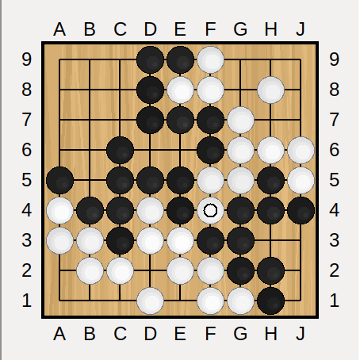   |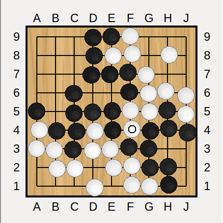

 value = 0.5           | value = 0.75
 :-------------------: | :--------------------:
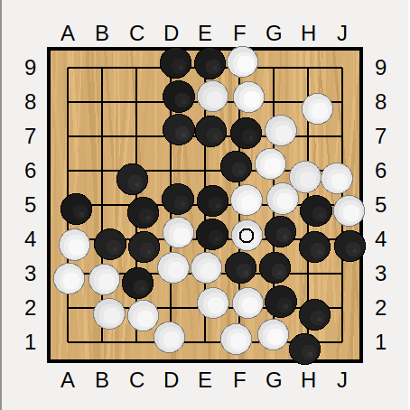   | 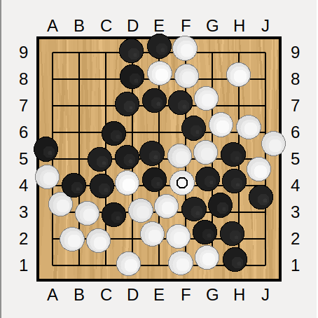 

**Real Game sequence deepness**: This parameter defines how many moves of the actual game you want to be previewed on the 2 actual game tabs during review. You can compare the results of having this value set at 5 or set at 20 on the two following pictures:

Real game sequence deepness = 5:

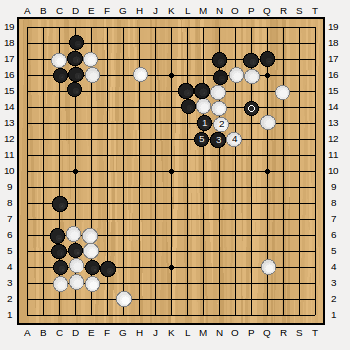

Real game sequence deepness = 20:

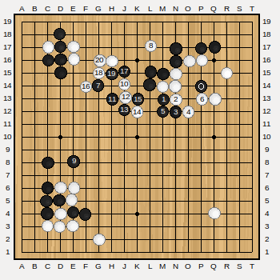

**Maximum number of variations to display during review**: Usually a bot will propose up to 10 variations for each moves. Sometimes more. You may want to limit the number of variations to display during the review, and only keep the ones with the highest win rate. This is what this setting is there for. The difference with the *Maximum number of variations to record during analysis* setting is that the former controls how many variations are saved in the RSGF file, while the second controls how many variations are displayed. If a friend of you sends you a big RSGF file with too many variations for you, you can reduce the number of variations displayed on your computer to focus only on the best 3 variations.

**Blue/red coloring of the variations**: This setting offers three ways to color the variations proposed by the bot:

 + **Win rate > 50% in blue** : Only the variations with a win rate higher than 50% will be represented in blue.

 + **The best variation in blue** : Only one variation, the one that the bot would have selected, will be in blue. Keep in mind a bot does not necessarily play the move with the highest win rate, especially when that variation was not backed by a high number of simulations.

 + **Variations better than actual game move in blue** : Only the variations with a win rate higher than the win rate of the actual game move will be represented in blue.

As GnuGo does not provide win rate for his variations, they are always represented in black.
Also, the game move win rate is determined by calculating the win rate of the bot's best reply to that move. That means that, in order to have all the win rates available at each move, the analysis must have covered both colors.

**Labels for variations**: Two possibilities are available:

+ **Letters** as label : Variations are labeled with letters, from the best variation labeled as **A**.
+ **Percentages** as label : Variations are labeled with the variation win rate. Keep in mind that a bot does not necessarily play the move with the highest win rate, especially when that variation was not backed by a high number of simulations.

You can compare the difference on the two images below:

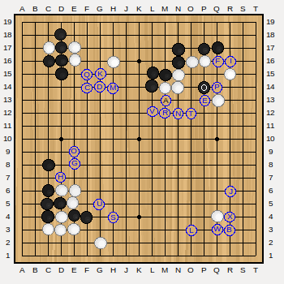

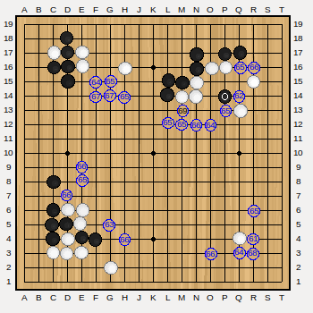

**Invert mouse wheel**: The mouse wheel can be used to display the moves of the variations one by one. This option allows to invert the mouse wheel.

## Bot settings

The following 5 sections are used to set all bots. All bots share a number of settings. Here they are (screen-shot taken from Ray):

Firstly, for each bot, GRP proposes to set 2 profiles:

+ **Slow profile** : This profile should be set with a long thinking time, or high number of play-outs, to maximize the bot strength. Such profile won't be convenient to play because it might take too long to answer your move (like 30s to 2mn). It is advised to use this profile for analysis only (SGF file analysis or live analysis).

+ **Fast profile**: This profile should be set with a short thinking time or a low play-outs number so that the bot can play a move in 10s or less. Such profile is then indicated for real time play, as an opponent in live analysis, or when opening a position for interactive play.

Both **slow profile** and **fast profile** propose to set a **command** and some **parameters** for the bot.

+ **Command**: This is the path to your bot executable. The path can be absolute or relative, but is it recommended to use the absolute path.

+ **Parameters**: These is the parameter string to be given to the bot.

There is also a button **Test** that will try to run the bot based on the **command** and **parameters** you provided, and redirect the output to a terminal like window to help you ensure the bot is working fine, and help debugging the issues if any. The top part of the terminal represents the standard output of the program, the lower part represents the error output.

For example, when launching Leela on my computer:

Pressing the **Send GTP command** can be used to send a GTP command, in this case, the **genmove black** command that asks the bot to play one move as black. Here is the result (black plays at C4) on my computer:

Use this testing feature only to check the bot is working as usual.

Following are the descriptions and specifics options of the 5 bots available in GRP.

### AQ settings

[AQ](https://github.com/ymgaq/AQ) is a bot by Yu Yamaguchi, distributed under MIT License. AQ is very strong already and is regarded as the first open source bot having beat a professional player on commodity hardware. Moreover, AQ seems to be used a lot by Japanese pro players for training on their own Go sever, where AQ has a 95% win rate against them.

Version 2.1.1 (with or without GPU) is supported.

AQ has been trained on 19x19 boards with komi at 6.5, no handicap and Japanese rule set, so AQ should be you first choice to review games with those conditions if your computer is strong enough.

The settings of AQ are mostly done in the **aq_config.txt** file, but different configuration files can be used for **slow profile** and **fast profile** using the **--config** parameter. For instance: **--config=aq_config_slow.txt**.
The location of the configuration file can be provided as absolute path, or path relative to the AQ executable.

### GnuGo settings

[GnuGo](https://www.gnu.org/software/gnugo/) is a free program that plays the game of Go.

Its strength is nowhere near that of Ray, Leela, Leela Zero or AQ, but its analysis is still relevant if your strength is about 11kyu or weaker.

Beside, GnuGo runs well and fast on old computers (Ray, Leela and AQ won't run on 32-bit computers), can play on 9x9, 13x13 and 19x19 boards, with all sort of handicaps and all possible komi values.

GnuGo is not using Monte Carlo methods (MTCS) so its behavior may feel much more human in those situations:

+ GnuGo is loosing the game: it will still play until the end, and try to maximize its score, not its win rate (no [horizon effect](https://en.wikipedia.org/wiki/Horizon_effect)).
+ GnuGo is winning by a large margin: it will still try to maximize its score, not its win rate, so it won't give points away and win the game by 0.5 points.
+ The above points are particularly true in handicap games

Some of the parameters you may want to add are:

+ **--mode=gtp** in fact, you **must** add this parameter, as it tells GnuGo to run in GTP mode
+ **--Chinese-rules** add this parameter to tell GnuGo to use Chinese scoring
+ **--level=10** add this parameter to adjust the level of GnuGo. Default level is 10.

GnuGo specific settings are:

+ **Maximum number of variations**: this is the maximum number of variations you want GnuGo to come up with for each move. Usually, GnuGo won't have more than 10, but you may want to reduce this number to make the analysis faster.
+ **Deepness for each variation**: This is, for each variation, how deep GnuGo should keep playing. The higher this number, the longer the analysis time.

### Leela settings

[Leela](https://www.sjeng.org/leela.html) is a strong bot, by Gian-Carlo Pascutto. Leela saw a huge increase in strength following Google/Deepmind publication in Nature, and in 2016 became the strongest Go bot free to download and use.

It fact, Leela is what prompted me to start GoReviewPartner.

Leela is dan level on all sorts of hardware, with or without GPU. Leela can play on 9x9, 13x13 and 19x19 boards, with komi values of 7.5, 6.5 and 0 (preferred komi is 7.5), with and without handicap. So if you are a kyu player with a modest computer or laptop, then you should consider using Leela.

Version 0.11 is supported.

Some of the parameters you may want to add are:

+ **--gtp** in fact, you **must** add this parameter, as it tells Leela to run in GTP mode
+ **--noponder** pondering is not necessary during the analysis, so better to disable it
+ **--playouts 10000** (or any other value) to provide a play-outs limit. The more play-outs, the stronger Leela becomes, yes, but it does not scale directly (two times more play-outs won't make Leela two times stronger). But more play-outs will make Leela provide more variations, and deeper variations.

Leela specific settings are:

+ **Time per move**: is how you tell Leela how many seconds maximum it should spend thinking on each move. You can leave this setting empty, or set to 0, to let Leela decide herself.

### Ray settings

[Ray](https://github.com/zakki/ray)) is a strong bot, by Yuki Kobayashi, distributed under BSD License. The latest version of Ray, RLO, now makes use of the Leela Zero type of weights file, including the ELF weights.

Version rlo-0.2.1 is supported.

Some of the parameters you may want to add are:

+ **--no-gpu** indicates to Ray that no GPU should be used. Note that Ray is very weak without GPU. You may as well use Leela instead...
+ **--const-time** (ex: **--const-time 20**) is how you tell Ray how many seconds it should spend thinking on each move
+ **--playout** (ex: **--playout 10000** any other value) to provide a play-outs limit

When started for the first time, the OpenCL tuner will run to optimize your GPU running parameters, so the analysis of the first move may take several minutes to complete.

### Leela Zero settings

[Leela Zero](https://github.com/gcp/leela-zero)) is a project initiated by Gian-Carlo Pascutto, which aims at reimplementing the system described in the Alpha Go Zero paper "Mastering the Game of Go without Human Knowledge". It is a collaborative project, under the GPL 3.0 license.

This bot is in permanent process of learning to play by playing against itself. It is now the strongest bot available for free, even beating pro players in handicap games. You are encouraged to contribute to this project by sharing your computer power.

Leela Zero is training on 19x19 board, using komi of 7.5, no handicap and the Chinese rule set, so Leela Zero should be your first choice to review games with those conditions if your computer can run it.

Some of the parameters you may want to add are:

+ **--gtp** in fact, you **must** add this parameter, as it tells Leela Zero to run in GTP mode
+ **--weights** (ex: **--weights weights.txt**) in fact, you **must** add this parameter, as it indicates which version weights file should be used. The weights file address is provided relative to the executable address. So the easy way is to place that file in the same folder as Leela Zero.
+ **--noponder** pondering is not necessary during the analysis, so it's better to disable it
+ **--playouts 10000** (or any other value) to provide a play-outs limit. The more play-outs, the stronger Leela Zero becomes, yes, but it does not scale directly (two times more play-outs won't make Leela Zero two times stronger). But more play-outs will make Leela Zero provide more variations, and deeper variations.

Leela Zero specific settings are:

+ **Time per move**: is how you tell Leela Zero how many seconds it should spend thinking on each move. You can leave this setting empty, or set to 0, to let Leela Zero decide herself.

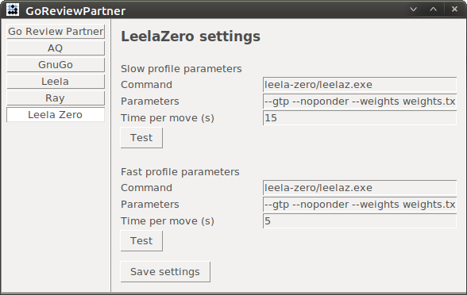

# Running analysis

Running the analysis is a very straightforward process:

+ Select a SGF file
+ Select a bot
+ Select a game tree variation
+ Select the range for analysis (moves & color)
+ Run the analysis

Selection of SGF is made from the main panel, either from an SGF on your computer (press the **Open a SGF file for analysis** button) or from an on-line SGF (press the **Download a SGF file for analysis** button). See the [Main panel and software overview](#main-panel-and-software-overview) section for more information.

If you choose to download the SGF file directly from the network, you will be asked to write or paste the URL into that pop-up, then press the **Get** button:

GRP will then let you select the analysis parameters:

**Bot to use for the analysis** will display the bots and profiles currently configured (if no command was provided for a bot, it won't be listed).

**Select a variation to be analyzed** lets you choose which line of play to follow in the analysis. Typically, a game record SGF file only contains one variation, but if a move was undo-ed during the game, this may have created a second branch. Pay attention to the number of moves in each branch to decide which branch to analyze. Other branches will be removed from the RSGF tree, to avoid confusion with the bot's new variations.

**Select moves to be analyzed** lets you chose the range of moves to analyze. You can analyze all of them, or only a subset of them. One or more move intervals can be indicated (ex: **10-20,40,50-51,63,67**).

**Select colors to be analyzed** lets you chose which player's move to analyze. It is **strongly** advised to analyze both Black and White every time, as this is necessary to produce delta graphs.

**Confirm the value of komi** lets you double check and adjust komi if necessary. By default, GRP will select the komi value from the SGF file. However, sometimes this information is missing in the SGF file (GRP will report it as 0), sometimes, the value is reported incorrectly (e.g. 750 instead of 7.5) and that would confuse the bot. So correct that value if necessary.

**Stop the analysis if the bot resigns** allows stopping the analysis automatically when the bot would resign.

When this is done, just press **Start** button to start the analysis.

The indicated remaining time is an approximation only. After the analysis of the first move is completed, GRP will propose to directly open the RSGF file in review mode:

You can save the review for later if you want. The RSGF file will have been saved right next to your original SGF file, with the same name, except for the file extension.

# Resuming an analysis

If for some reason, you had to stop the analysis of one game (laptop short of battery, or computer crash) there is a possibility to resume the analysis.

Press the **Open a SGF file for analysis** button from the main panel, as you would do to start the analysis of a new game. But then, tell the file picker you want to select an RSGF file instead of an SGF file:

Next select the RSGF file that was produced before the analysis was interrupted. GRP will take note of that, and the analysis parameter panel will be a bit different:

GRP will now perform the analysis on the tree's main variation only (this cannot be changed), and GRP is now asking what to do with the variations created during the first analysis run. You have two choices:

+ **Keep existing variations**: the moves with existing variations are not analyzed again, so the analysis is skipped for those moves. But the variations and data stay in the RSGF file. This is what to use when resuming an analysis to complete it.

+ **Replace existing variations**: the former variations/data will be discarded and replaced by new ones. This is useful for this use case: You can first analyze a game with a fast profile to see the win rate graph and get an idea where you went wrong. Then you can rerun the analysis on a limited range of moves (for example only the middle game, or the area where the win rate dropped a lot) using the slow profile to have a deeper analysis of those moves only. After that, the RSGF contains analysis for all moves, but detailed analysis only on the limited range for the second analysis run.

# Data

During the analysis, GRP will have collected, for each position, alternative moves and variations. And for all those moves, GRP is usually able to extract some meaningful data. Here is an overview of that data and its meaning.

## Win rate (WR)

Win rate, which means "chance of winning" indicates how confident a bot is that it would win the game from that position. Most bots would resign if their win rate drops below 15%.

+ Leela, Ray and AQ are inspired by the first version of AlphaGo, and estimate their win rate as a combined function of their Value Network win rate and Monte Carlo win rate (see below).
+ Leela Zero is inspired by AlphaGo Zero, and directly uses her Value Network win rate as win rate.
+ GnuGo does not provide win rate.

## Value Network win rate (VN)

Value Network win rate is the "chance of winning" of a given board position, as provided by a neural network that has been trained for this purpose. Value Network neural networks are trained for a given komi and a given handicap, and so are only capable to evaluate correctly a position for a game played in similar conditions.
For that reason, it's better to use for analysis the bots with the same komi and handicap as the game. This is especially important for Leela Zero because she only relies on this value.

GnuGo does not provide Value Network win rate.

## Monte Carlo win rate (MC)

Monte Carlo win rate is the "chance of winning" of a given board position, as estimated by playing out that game randomly hundreds of times. This estimation is usually pretty bad at the beginning of the game, and gets more and more accurate as the game progresses. It complements the Value Network win rate, and is useful for games where the komi and handicap differ from what the Value Network neural network was trained for.

GnuGo does not provide Monte Carlo win rate.

## Policy Network value (PN)

Policy Network is a value that indicates what would be the most probable next move for a given board position. This data is provided by a dedicated neural network trained from human games (for Leela and AQ) or from self play games (Leela Zero and Ray-RLO). Policy Network values are what is used to draw the heat map.

GnuGo does not provide Policy Network value.

## Playouts (PYO)

Play-outs, for one variation, indicates how many games where simulated to evaluate that variation. The higher the number of play-outs, the more confident the bot will be about its evaluation.

GnuGo does not provide Play-outs numbers.

## Score estimation

Some bots can also provide a score estimation. It is usually not accurate at all unless the game is already in yose.

# Game review

To review a RSGF file, open it from the main panel **Open a RSGF file for review** button. This will open a double board interface:

## Interface overview

+ The top-left bar provides the usual commands to navigate the RSGF file, move by move, or jumping 10 moves, or going directly to the beginning/end of the game. Your keyboard Left and Right keys can be used as well.

+ Then, the interface is divided in two panels, and each panel contains a number of tabs. Both panels at least contain one **Actual game** tab and one **Analysis** tab:
    + The **Actual game** tabs are there for you to check out what was played in actual game. See detailed description below.
    + The **Analysis** tabs are there for you to check the alternative lines of play as proposed by the bot. See detailed description below.

+ **Actual game** and **Analysis** tabs' gobans indicate the last played stone as a circle marked stone

+ It it possible to open additionnal gobans by clicking on one of the two **+** tabs. This will create new tabs, containing gobans that can be used to try out other variations, and play againts bots.

+ The right side panel displays the analysis data. That data can be displayed either in a textual form ("Comments panel") or in a tabular form ("Table panel").

+ The top-right bar provides commands to display the graphs and switch between "Table" and "Comments" mode of data display.

+ At the bottom is a status bar that will display information on how to use the interface.

The sizes allocated to the two tabs and the right side panel can be adjusted manually with the mouse pointer. You can totally hide the left side tabs if you don't need them and find them distracting:

## Comments panel

The right side panel is used to display information on the current position:

## Actual game tabs

The **Actual game tabs** are there for you to check out what was played in the actual game.
You will find one variation labelled "A" that indicates where the game move was played:

Move you mouse pointer over that "A", and the following moves will be displayed with each move numbered. If you want to follow the sequence move my move, then you can use your mouse scrolling wheel, it will display the moves one by one. Your keyboard Up and Down keys can be used as well.

The **Actual game** tabs can also be used to display **maps** built by the bot during the analysis. There are 3 types of maps, but not all bots support them. Use the **Maps** drop down menu to select what map to display, and press the **Show** button to display it on the goban.

+ **Territories**: indicates what intersections on the board the bot considers to be black or white territories. This map is provided only by GnuGo.
+ **Influence**: indicates what intersections on the board the bot considers to be under black or white influence. This map is provided only by GnuGo and Leela.
+ **Heatmap**: indicates the Policy Network values for each intersection, with higher values in bright red. High Policy Network values indicate the locations the bot is considering to play "at first sight". With more thinking (playouts), the bot may discard those moves and play elsewhere. This map is provided only by Leela and Leela Zero.

Example of influence map:

Example of heatmap:

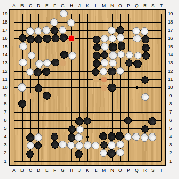

## Analysis tabs

On the **Analysis** tabs' gobans there are available different variations for this game position. The variations are the variations provided by the bot, with **A** being the best variation (the one the bot would choose), then **B**, **C**... second and third best variation, and so on.

If no variation is available, this could be because:

+ that move was not a part of the moves analyzed
+ the bot would chose to resign or pass for that move.

The variations may have different colors depending on the **Blue/red coloring of the variations** setting. Percentage values could be used instead of the letters depending on the **Labels for variations** setting. See the [Settings](#settings) section for more information.
You can use the **Display** drop down menu to change the display parameters.

Note that if the letter/percentage color is black (inside a red or blue circle) this indicates that this move was also the actual game move.

Move you mouse pointer over one of the variation, and the complete sequence of moves will be displayed with each move numbered. Additional information for that line of play will be indicated in the right side panel.

If you want to follow the sequence move my move, then you can use your mouse scrolling wheel, it will display the moves one by one. Your keyboard Up and Down keys can be used as well.

## Graphs

Using the data provided at each move allows to draw some interesting graphs.
Not all bots provide all types of graphs. Leela is the one offering the most graphs.

### Win rate, Value Network win rate and Monte Carlo win rate

Those graphs consist of the successive values of win rates, from the black perspective.

Clicking on one of the grey bars will bring to that position in the review panel. A yellow bar indicates the current position in the review.

When no bar is available for a move, it means no data was provided, possibly because:

+ that move was not a part of the moves analyzed
+ the bot would chose to resign or pass for that move
+ this was a "book move", taken from a joseki dictionary without performing an analysis

### Delta graphs

By comparing the win rate (or Value Network win rate, Monte Carlo win rate) at one move (when the bot's best move would be played) with the win rate of the following move (the case when the actual game move was played), one can draw a **delta graph** for each color.

This is a graph that indicates by how much the bot believes it could have played better than the human player, or eventually by how much the human player move was better than its own move. The difference between both win rate percentage values is called **delta** and is given in [percentage points](https://en.wikipedia.org/wiki/Percentage_point) (pp).

On a delta graph:

+ The grey bars follow the win rate for that color only
+ The red bars, **on top of** the win rate blue trend, indicate by how much the bot's own moves would improve the win rates. The higher the red bars, the more the bot considers the human moves to be bad.
+ Inversely, The green bars, **on bottom of** the win rate blue trend, indicate by how much the bot's own moves would decrease the win rates. The higher the green bars, the more the bot considers the human moves to be better than its own moves.

When no grey bar is available, it means no data was provided by the bot, possibly because:

+ that move or the following move was not a part of the moves analyzed,
+ the bot would chose to resign or pass for that move or the following move,
+ this move or the following move was a "book move".

So red means margin for improvement, and green means better than the bot, from the bot's point of view.

On the delta graph above:

+ One can see that move 113 could be considered a big blunder for black, with a delta of -21.5pp
+ At move 117, black missed the opportunity to re-balance the game, and could be considered as the loosing move.

Here is the corresponding white comparison graph:

One can see that:

+ White blundered at move 96
+ White also blundered at move 116, but hopefully for White, Black missed that opportunity as we have seen above already.

Here is the actual game position:

Apparently, Leela believes Black should tenuki and break into White center territory.

Delta graphs are a powerful learning tool.

### Table

You can replace the comments with a table by pressing the **Table** button in the top-right bar:

The table is designed to present the user with the maximum of information, in a very condensed way. It's the opposite of the (very verbose) comments panel.
After you get used to reviewing your games with GRP, you will probably prefer using the table instead of the comments. Somehow, the table is more for "hardcore gamers" :)

+ The first line indicates the move number and win rates for black and white.
+ The second and third line indicate the game move and bot move.
+ The fourth line indicates the deltas for win rate, Value Network win rate and Monte Carlo win rate.
+ Finally, there is the table with the data available for each variation. Bringing the mouse over the table will display the variation in the analysis goban.

The table only uses acronyms to save on space (e.g. MC for Monte Carlo). If you are not sure about the meaning of any of them, bring your mouse pointer over it to get an explanation in the status bar.

Press the **Comment** button to switch back to the comments panel.

## Opening a move for interactive play

During the game review, you might want to try out your own variations against a bot. This is made possible by pressing one of the **+** tabs.

This will open the game position in an additionnal tab, where you are free to manually try other lines of play. The **Undo** button allows to cancel the last move played.

You can ask the bot to play with you along the variation, and then check its answers to your different variations.

If a bot is not in the list, it could be because:

+ that bot does not support that size of Goban,
+ no command line was provided for that bot,
+ the bot failed during launching, then you should double check its command line and parameters,
+ a bot can be disabled if you play a move it considers illegal.

The different Actions to control the bots are:

+ **Do nothing**: the default setting. The bot does not answer your move.
+ **Play one move**: the bot will play the next move based one whose turn it is (Black or White)
+ **Play as white**: the bot will answer as white every time you play one move as black
+ **Play as black**: the bot will answer as black every time you play one move as white
+ **Let the bot take both sides and play against itself**: The bot plays against itself starting from that position. To have the bot stop playing, select **Do nothing** again.
+ **Ask the bot for a quick evaluation**: The bot provides a quick evaluation on the variation you played, typically the win rate

While the bot is thinking for a move, the interface will be locked, the goban outline appears in red. There is no way to abort the bot while it is thinking, you have to wait for it to come up with its move.

In self play mode, to stop the bot, select **Do nothing** again.

There is no limit to the number of new tabs you can open. Tabs can be closed by pressing the **X** button in the top right of the tab:

## Highlighting stones or intersection

On all gobans (this is also available in Live analysis), it is possible to highlight a stone or an intesection, simply by using the mouse right click.
The stones or intersections will "shine" for a few seconds:

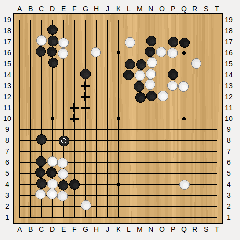

When is this useful? It can be used when streaming, to draw viewers' attention to some special stones or intersections. I.e. instead of saying "*Playing at R7 or Q8 is possible*" (or instead of using an editing tool to mark those intersections), simply right-clicking on them will make them very noticeable for a few seconds.

# Live Analysis

A live analysis makes it possible to record a game or play against a bot, while, in the background, having the analysis proceed. This is a way to save on the analysis time, so that when the game is over, a part of the analysis is already completed, and the review can start immediately.

It also has the advantage of making the result of the analysis directly available (given the bot performing the analysis is fast enough to catch up with the game speed), which is useful during a live commentary.

## Live analysis setting

Here is the setting panel for a live analysis, and the meaning for each settings:

**Bot to use for analysis** lets you choose what bot will perform the analysis. It is probably better to select a **slow profile** bot.

**Black player** and **White player** lets you choose who is playing for black and white. You basically have three options:

+ **Human**: you will enter the move one by one for that color.
+ **Bot used for the analysis**: you want to reuse the bot performing the analysis in the background to play for that color as well
+ **Another bot**: some other bot will play for that color

**Board size**, **Komi**, **Handicap stones** are the usual game settings. Handicap stones have free placement.

**SGF file name** allows you to select where the RSGF files will be saved.

**Select colors to be analyzed** allows to restrict the analysis to only black or white moves.

So here are some different ways to use the live analysis mode:

+ **Human VS Human**:
    * You can use this mode when watching a game online or at a tournament. If the bot used for analysis is faster than the players, then it will provide you with near real time data about the ongoing game, like win rate, and different possibilities for the ongoing moves.
    * You can use it when playing across the board, to record the game. At the end of the game the analysis result can be used to discuss the game with your opponent and check out your respective mistakes.
    * It can also be used when reading a game commentary: you enter the moves as you read the commentary, and play the variations in the **open position** mode. Then you can stop at different moves and check the bot's own opinion against the commenter opinion.
    * Of course, the bot opinion is relevant only if the bot is stronger than the human players.

+ **Human VS Bot**: This is mainly for training. You play against the bot, and atthe end of the game, you review the analysis. You can also stop mid-game and check the analysis of the first part of the game.
    * You can play against one bot and have another analyse your game. Then it makes sense to have the first bot weaker than the bot performing the analysis:
        + You can use the **slow profile** version of a bot for analysis, and the **fast profile** version of that same bot to play against you.
        + If your level is DDK (11 kyu or weaker) then you can play against GnuGo, and have Leela perform the analysis, and point out your mistakes and how to avoid them, as well as GnuGo's mistakes and how to exploit them.
        + You could also set Leela Zero with an old weights file as her **fast profile** and using the latest weights file for her **slow profile** for the analysis.
    * You can set the bot playing with you to be the same as the bot used for analysis. This is useful to save on computing, because the bot analysis is performed at the same time it is choosing its next move. But in that case, you will have to wait for the bot to finish analysing your last move before it starts thinking about its next move. Also, because it plays and analyzes at the same time, the deltas for its moves will all be at zero (because it considers its moves the best moves).

+ **Bot VS Bot**: this is a possibility, but I am not sure for what use case...

When a second bot, not the one analysing, is selected as black or white, or when black and white are played by different bots, then the additional option **No overlap thinking time** appears. This setting tells GRP to make sure the bots are not thinking at the same time, so that your computer processing power (CPU, GPU, RAM) does not become a shared resource that both bots are competing for.

Depending on the situation, this option will be or won't be useful:

+ If the bots have a limited number of play-outs, then it is not really necessary.
+ If one bot runs on CPU and the other one on GPU, then it is not that necessary.
+ If one of the bots is ran across the network from another computer, then it is not really necessary.
+ If the bot has a limited thinking time, then you **should** use it.

Generally speaking, it is best to use play-outs limits for your bots. You can also set the process of the bot performing the analysis to run at low priority, so that it won't make your opponent slower.

Press the **Start** button to start the Live analysis. You will be asked to place the handicap stones first, if any.

## Playing

Here are the live analysis panels, the first one is Human VS Bot, the second is Bot VS Bot:

**Game** section provides some basic information on the current game. If it is a Bot VS Bot game, there will be a **Pause**/**Resume** button to pause the game. If it is a Human VS Human game, or Human VS Bot game, there will be an **Undo** button available as well as a **Pass** button.

**Analysis** section provides some basic information on the background analysis. There is an **Open position** button available at any time to try out variations. And when the analysis for the 2 first moves is completed, a **Start review** button will appear that starts the usual review panel for this game. Of course, only the moves already analyzed will be available, but the review panel will update itself automatically as the analysis progresses.

The same way you can open new gobans during review for interactive play, new gobans can be opened during live play, ie. by pressing the **+** tab. The features are the same:

# Convert RSGF file to SGF file

RSGF is an SGF file that contains non-standard properties. Such properties are used to save the win rate, the value network win rate, the number of play-outs and so on. A standard SGF editor can open a RSGF file but won't be able to interpret those properties.

Converting a RSGF file to an SGF will put all that data into SGF comments for each move and variation, making it possible to review the data with a normal SGF editor. The resulting SGF file will be bigger.

# Convert RSGF file to CSV file

GRP offers a basic tool to convert RSGF files into CSV (**Comma Separated Values**) files. CSV files allow to record tabular data, and can be opened with Excel or LibreOffice.
The CSV file will contain data like win rates for the game:

# Advanced uses

It is possible to use GRP as a command line tool, to automatize the analysis. This is only possible when running directly from the Python sources.

Each bot comes with its own Python file:

+ **aq_analysis.py** for AQ
+ **leela_analysis.py** for Leela
+ **gnugo_analysis.py** for GnuGo
+ **ray_analysis.py** for Ray
+ **leela_zero_analysis.py** for Leela Zero

Those Python scripts can be used as follows:

    Usage: python bot_analysis.py [--range=<range>] [--color=both] [--komi=<komi>] [--variation=<variation>] [--profil=<fast|slow>] [--no-gui] <sgf file1> <sgf file2> <sgf file3>

Here are a few examples:

+ Analysis of mygame.sgf, first variation, using Leela (slow profile), all moves, both colors, komi as indicated by the SGF file:

        python leela_analysis.py --profile=slow mygame.sgf

+ Same as above, the three SGF files will be analyzed, and using Leela fast profile:

        python leela_analysis.py --profile=fast mygame1.sgf mygame2.sgf mygame3.sgf

+ Same as above, but all the SGF files will be analyzed, and the analysis will be performed by Ray:

        python ray_analysis.py *.sgf

+ Analysis of black moves only:

        python ray_analysis.py --color=black mygame.sgf

+ Analysis of moves 10 to 20, 44, 46 and 100 to 110 by AQ:

        python aq_analysis.py --range="10-20, 44,46, 100-110" mygame.sgf

+ Analysis of variation 3, setting the komi at 7.5 (some SGF files do not include komi):

        python aq_analysis.py --variation=3 --komi=7.5 mygame.sgf

If the **--no-gui** parameter is provided, GRP will be running only in the terminal, no graphical interface.

If no **--profile** parameter is provided, GRP will be using the slow profile.

The conversion from RSGF to SGF or CSV can also be done in command line:

    python r2sgf.py game1.sgf
    python r2csv.py *.sgf

Those commands can be ran from the terminal, or from a bash script or batch script.