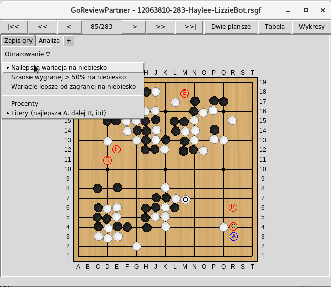
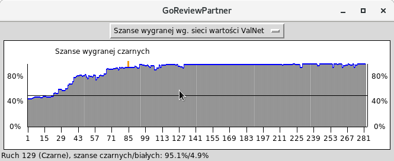

# Przeznaczenie

Go Review Partner ("GRP") to narzędzie do analizy i przeglądania gier go (weiqi, baduk) z pomocą botów.

GRP nie jest kolejnym edytorem SGF. Nie da się w nim przeglądać, ani modyfikować istniejących plików SGF (dodawać wariacji czy komentarzy).

Otwiera on istniejący plik SGF z zapisem gry i przekazuje zawartość go botowi. Następnie bot zwraca listę najlepszych ruchów do zagrania w każdej pozycji w grze. Obecnie obsługiwane są: [GnuGo](https://www.gnu.org/software/gnugo/), [Leela](https://www.sjeng.org/leela.html), [Ray](https://github.com/zakki/Ray), [AQ](https://github.com/ymgaq/AQ) i [Leela Zero](https://github.com/gcp/leela-zero).

Dodatkowo GRP oferuje przyjazny interfejs do przeglądania tych danych.

Istnieją również dwa inne programy do analizy plików SGF z pomocą Leela Zero:

+ [Leela Sabaki](https://github.com/SabakiHQ/LeelaSabaki) bardziej zbliżony do typowego edytora SGF,
+ [Lizzie](https://github.com/featurecat/lizzie), którym można dokonywać analizy pozycji w sposób bardzo interaktywny.

Oba projekty są ciekawe i warte wypróbowania. GRP różni się od nich tym, że wykonuje analizę całej gry za jednym razem, automatycznie. Dzięki temu może być używany na starszych czy wolnych komputerach, analizując w wolnym czasie (w nocy, w godzinach pracy), zapisując wynik analizy do późniejszego wglądu. Ponadto GRP nie ogranicza się do Leela Zero, a ma ambicję obsługi każdego silnego i popularnego bota.

# Przebieg przeglądu gry

Zasadniczo jest to proces dwustopniowy:

+ analiza pliku **SGF** przez bota w celu wytworzenia pliku **RSGF**
+ przegląd otrzymanego pliku **RSGF** przy użyciu GRP

## Analiza pliku SGF przez bota

Najprościej mówiąc, polega to na otwarciu pliku SGF przez GRP, wybraniu bota do analizy, i wykonaniu analizy.

Istnieje możliwość wyboru określonego zakresu ruchów do zbadania, albo tylko jednego koloru.

Uwaga! Analiza może być czasochłonna. Im masz wyższą siłę, tym silniejszy powinien być bot, by dać wartościowy wgląd w Twoją grę. Więc jeśli bot ma spędzić 20 sekund nad każdym ruchem, a gra ma 250 ruchów, to przygotuj się na przeszło dwugodzinne oczekiwanie.

Co więcej, analiza wymaga od komputera znacznej ilości pracy, i dlatego komputer może w tym czasie mieć obniżoną reaktywność do tego stopnia, że nie będzie się dało z niego korzystać!

Tak więc idź śmiało na herbatę/kawę, prześpij się, pograj w Internecie, porób tsumego, co lubisz... I wróć do komputera kiedy już analiza zostanie ukończona.

Co będzie robił komputer w tym czasie? To zależy od bota, który analizuje, ale generalnie zatrzyma się na każdym ruchu i spyta bota jaki ruch by zagrał w tej pozycji. Właściwie to będzie to kilka ruchów i dla każdego z nich bot prześle sekwencję kontynuacji, jaką sobie przedstawia w danym punkcie gry. Zazwyczaj dostarcza też dodatkowych informacji dla wszystkich tych wariacji, np. szanse zwycięstwa.

Podczas analizy wszystkie te informacje są zbierane i konsolidowane przez GRP, żeby utworzyć nowy plik SGF o zmienionym rozszerzeniu RSGF (*Reviewed SGF*). Więc jeśli plik wyjściowy to **moja_gra.sgf**, to powstały plik RSGF będzie się nazywał **moja_gra.rsgf**.

Więcej informacji w sekcji [Przeprowadzanie analizy](#przeprowadzanie-analizy).

## Przegląd pliku RSGF z wykorzystaniem interfejsu GRP

Kiedy analiza zostaje ukończona, powstaje plik RSGF.

Jest to poprawny plik SGF, ale uwierz mi - nie chcesz go otwierać zwyczajnym edytorem SGF. To dlatego, że analiza zbuduje bardzo duże drzewo gry: wyobraź sobie, że dla każdego z 250 ruchów gry stworzonych zostanie 5 wariacji, a każda o głębokości około 10 ruchów. Przeglądanie tego zwyczajnym edytorem SGF to istna męczarnia.

Wciąż chcesz go otworzyć zwyczajnym edytorem SGF? Żaden problem. Zmień rozszerzenie pliku z **.rsgf** na **.sgf** i się przekonaj.

Gdy dostępnych jest zbyt wiele informacji, sposób prezentacji i nawigacji po danych jest decydujący. GRP posiada interfejs dostosowany do przeglądania plików RSGF.

Zobacz [Przegląd gry](#przegląd-gry), aby poznać więcej szczegółów.

# Instalacja i uruchomienie

Właściwie to GRP jeszcze nie da się jeszcze zainstalować. Jest to osobna aplikacja, która nie posiada instalatora.

Istnieją dwa sposoby na uruchomienie GRP:

+ ze ściągniętej paczki wydania (to najłatwiejszy sposób pod Windowsem)
+ z kodu źródłowego

## Uruchomienie z pobranej paczki

To rekomendowany sposób, jeśli używasz systemu Microsoftu i nie chcesz ściągać botów ani konfigurować GRP samemu. Linki do paczek znajdziesz pod adresem [strony projektu](http://yuntingdian.com/goreviewpartner/).

Ściągnij plik archiwum ZIP i rozpakuj, gdzie uważasz za stosowne. Wewnątrz rozpakowanego folderu znajdziesz plik wykonywalny **GoReviewPartner.exe**. Po prostu go uruchom. Upewnij się, że rozpakowujesz archiwum w lokalizacji z uprawnieniami odczytu i zapisu, np. w folderach **Dokumenty** albo **Pulpit**.

## Uruchomienie ze źródeł

Uruchomienie GRP ze źródeł nie jest tak skomplikowane, jak się wydaje. Nie wymaga żadnej kompilacji i jest to polecany sposób uruchamiania dla osób choć trochę obytych z komputerami.

Uruchomienie *ze źródeł* także odblokowuje dodatkowe funkcje jak *analiza hurtowa*.

### Instalacja Pythona i TkInter

GRP jest napisany w Pythonie 2 i wymaga jego obecności na komputerze. Używa także biblioteki TkInter do wyświetlania interfejsu graficznego. Upewnij się, że masz je zainstalowane:

+ Na komputerze z systemem Microsoftu TkInter jest załączony do standardowej instalacji Pythona. Ściągnij Pythona z [oficjalnej strony](https://www.python.org). Wybierz ostatnią wersję 2 (2.7.x). Powinien to być plik **.msi*. Zapisz go na komputerze, a następnie uruchom, by zainstalować Pythona.
+ Na innych systemach operacyjnych (***nix**) być może trzeba zainstalować Pythona i TkInter osobno. Zależnie od systemu, komenda to coś w rodzaju:

        sudo apt-get install python python-tk

### Pobieranie i uruchomienie

Na tym etapie należy pobrać źródła GRP. Są one dostępne na [GitHubie](https://github.com/pnprog/goreviewpartner). Znajdź zielony przycisk "Clone or download. Wybierz "Download ZIP". Plik ZIP powinien się nazywać **goreviewpartner-master.zip**. Rozpakuj archiwum, gdzie uważasz za stosowne.

Na koniec, by uruchomić GRP:

+ Na Windowsie otwórz folder zawierający źródła. Znajdź plik **main.py** i uruchom go w Pythonie.
+ Na innych systemach otwórz terminal i wpisz

        cd ścieżka_do_main.py

    Używając ścieżki do folderu, gdzie znajduje się plik **main.py**. Następnie uruchom plik:

        python main.py

GRP powinien być teraz uruchomiony. Musisz go jeszcze skonfigurować, by mógł się kontaktować z botami. Zobacz sekcję [Ustawienia](#ustawienia).

# Panel główny

Po uruchomieniu GRP powinno pokazać się to okienko:

**Przeprowadź analizę pliku SGF** otwiera okieno wyboru pliku SGF do analizy. Zobacz [Przeprowadzanie analizy](#przeprowadzanie-analizy).

**Ściągnij plik SGF do analizy**  pozwala podać adres URL pliku SGF, a następnie ściąga plik z sieci i przeprowadza analizę. To się może przydać w przypadku nowoczesnych serwerów Go jak OGS, które udostępniają bezpośrednie linki do gier. Upraszcza to procedurę ręcznego ściągania i następnie wyszukiwania pliku do analizy na dysku. Zobacz [Przeprowadzanie analizy](#przeprowadzanie-analizy).

**Rozpocznij analizę na żywo** pozwala utworzyć zapis gry, albo zagrać przeciwko botowi, podczas gdy w tle dokonywana jest analiza. Tym sposobem skraca się czas analizy, bo gdy gra zostaje ukończona, część analizy jest już gotowa i można rozpocząć przegląd. Zobacz [Analiza na żywo](#analiza-na-żywo).

**Otwórz plik RSGF** otwiera okno wyboru pliku RSGF z dysku i odpala jego przegląd. Zobacz [Przegląd gry](#przegląd-gry).

**Przekonwertuj plik RSGF na SGF** otwiera wybór pliku RSGF do przekonwertowania na SGF. Zobacz [Przekonwertuj plik RSGF na SGF](#przekonwertuj-plik-rsgf-na-sgf).

**Przekonwertuj plik RSGF na CSV** rozpoczyna wybieranie pliku RSGF do przekonwertowania na CSV. Zobacz [Przekonwertuj plik RSGF na CSV](#przekonwertuj-plik-rsgf-na-csv).

**Ustawienia** otwiera okno, w którym definiuje się boty, niektóre z ich parametrów uruchomienia, a także ustala zachowanie GRP. Jeśli uruchamiasz GRP ze źródeł (a nie z pobranej paczki), to GRP należy skonfigurować przed jakąkolwiek analizą gier czy przeglądem.

Jeśli GRP nie znalazł żadnego bota w ustawieniach, analiza będzie niedostępna. Okno główne będzie wyglądało tak:

To oznacza, że należy wprowadzić albo sprawdzić ustawienia. Zobacz sekcję [Ustawienia](#ustawienia).

# Ustawienia

Tak wygląda okno ustawień GRP:

Obecnie ustawienia podzielone są na 9 sekcji. Pierwsza to:

+ **Go Review Partner**: ustawienia dotyczące GRP

Pozostałe sekcje dotyczą poszczególnych botów:

+ **AQ**
+ **GnuGo**
+ **Leela**
+ **Ray**
+ **Leela Zero**
+ **Pachi**
+ **PhoenixGo**
+ **boty GTP**

Do nawigacji pomiędzy sekcjami służy panel po lewej.

## Ustawienia Go Review Partner

Below are the settings available for this section, together with their meanings:

**Język**: Ten parametr definiuje język interfejsu GRP. Domyślny to angielski. Również dostępne są francuski, niemiecki, koreański, chiński i polski. Dodatkowe tłumaczenia nie są kompletne w 100%, więc czasem zdarza się termin czy fraza po angielsku, gdy brak tłumaczenia.

GRP musi być zrestartowany, żeby zmiana parametru przyniosła efekt.

Jeśli chcesz pomóc w tłumaczeniu GRP, daj mi znać. GRP używa systemu intrernacjonalizacji typu Gettext i nie wymaga umiejętności programistycznych przy dodawaniu tłumaczenia na nowy język.

**Maksymalna liczba wariacji do zapisania podczas analizy**: Bot zazwyczaj proponuje do 10 wariacji dla każdego ruchu. Jednak niektóre boty (jak Leela Zero) mogą podawać nawet ponad 300 wariacji na ruch! By uniknąć nadmiernego rozrastania się plików RSGF, ten parametr ogranicza liczbę wariacji zapisywanych w pliku. Ponieważ każda wariacja jest oznaczana etykietą podczas przeglądu, raczej nie potrzeba zapisywać więcej niż 26 wariacji.

**Zachowaj tylko te wariacje, gdzie bot gra inaczej**: Ta opcja decyduje, czy GRP odrzuci wszystkie wariacje w określonej pozycji, w których najlepszy ruch i ruch w zapisie gry są identyczne. To pomaga zredukować rozmiar pliku RSGF, co ma znaczenie szczególnie wtedy, kiedy się zamierza przegląd pliku RSGF w standardowym edytorze SGF.

**Zapisz linię poleceń bota do pliku RSGF**: Ta opcja pozawala zapisać linię poleceń bota w pliku RSGF do wglądu. Linia poleceń czasem zawiera przydatne informacje, takie jak: liczba symulacji, liczba używanych wątków czy plik wag.

**Zakończ analizę, gdy bot rezygnuje**: Podczas analizy, kiedy szanse wygranej jedny strony spadają zbyt nisko, bot niekiedy decyduje się na rezygnację. Ta opcja pozwala zatrzymać automatycznie analizy w tym punkcie, by zaoszczędzić czas. Ta opcja nie zakłóca przebiegu analizy na żywo (zob. [Analiza na żywo](#analiza-na-żywo)).

**Naturalne ułożenie kamieni**: Ten parametr określa dokładność ułożenia kamienie na przecięciach linii gobanu. Wartość 0 oznacza ułożenie dokładnie na przecięciu. Prawdopodobnie nie chcesz używać wartości powyżej 0.3.

Poniżej widać ułożenie przy różnych wartościach.

wartość = 0              | wartość = 0.25
:--------------------: | :-------------------:
   |

 wartość = 0.5           | wartość = 0.75
 :-------------------: | :--------------------:
   |  

**Długość podglądu kontynuacji w zapisie gry**: Ten parametr definiuje, jak wiele ruchów z zapisu przebiegu gry chcesz widzieć naprzód w podglądzie zakładek zapisu gry. Możesz porównać poniższe obrazki przedstawiające podgląd przy wartości parametru 5 i 20:

Długość podglądu kontynuacji = 5:

Długość podglądu kontynuacji = 20:

**Maksymalna liczba wariacji pokazywanych w czasie przeglądu**: Zazwyczaj bot zwraca do 10 wariacji, czasami więcej. Można ograniczyć liczbę tych wariacji i zachować tylko najlepsze. Po to jest ten parametr. Podczas gdy *Maksymalna liczba wariacji do zapisania podczas analizy* definuje ile wariacji jest zapisywanych w pliku RSGF, ten parametr określa ile wariacji jest wyświetlanych. Np. jeśli znajomy podeśle Ci duży plik RSGF o zbyt dużej liczbie wariacji, możesz zredukować liczbę wariacji wyświetlanych do 3 najlepszych, by na nich się skupić.

**Czerwone i niebieskie oznaczenie wariacji**: To ustawienie pozwala kolorować wariacje bota na trzy sposoby:

+ **Szanse wygranej > 50% na niebiesko**: Tylko wariacje o szansie wygranej powyżej 50% zostaną oznaczone kolorem niebieskim.
+ **Najlepsza wariacja na niebiesko**: Tylko wariacja, którą wybrałby bot, będzie oznaczana kolorem niebieskim. Pamiętaj, że bot nie zawsze gra ruch o najwyższej szansie wygranej. W szczególności jeśli ta wariacja nie została poparta wysoką liczbą symulacji.
+ **Wariacje lepsze od zagranej na niebiesko**: Tylko wariacje o szansach zwycięstwa lepszych niż szanse ruchu w grze zostaną oznaczone kolorem niebieskim.

Ponieważ GnuGo nie podaje szans wygranej dla swoich wariacji, są one zawsze przedstawiane na czarno.

Szanse wygranej są oceniane na podstawie kalkulacji najlepszej odpowiedzi bota na dany ruch. To oznacza, że aby uzyskać wszystkie szanse zwycięstwa w danym ruchu, zanalizowane muszą zostać oba kolory.

**Etykiety wariacji**: Dostępne są dwie możliwości:

+ **Litery** jako etykiety: Wariacje są etykietowane literami, od "A" dla najlepszej.
+ **Procenty** jako etykiety: Wariacje są etykietowane liczbą przedstawiającą szanse wygranej. Pamiętaj, że bot nie zawsze gra ruch o najwyższej szansie wygranej. W szczególności jeśli ta wariacja nie została poparta wysoką liczbą symulacji.

Dwa poniższe obrazki przedstawiają różnicę:

**Odwrócone koło myszy**: Koła myszy można używać do przeglądania ruchów wariacji jednego po drugim. Ta opcja pozwala odwrócić kierunek przeglądania.

## Ustawienia botów

Wszystkie boty konfiguruje się w podobny sposób. Poniżej przedstawiam kilka kluczowych terminów. (Zdjęcia ekranu dotyczą bota Leela Zero.)

Zależnie od wersji, generalnie GRP oferuje początkowo dwa główne profile dla każdego bota (które - również zależnie od wersji GRP - być może należy uzupełnić):

+ **Slow - wolny**: Ten profil powinien się charakteryzować długim czasem myślenia albo wysoką liczbą symulacji, w celu zmaksymalizowania siły bota. Taki profil może się nie nadawać do rozgrywki, ponieważ na odpowiedź na ruch potrafi zużyć od 30 sekund do 2 minut. Zaleca się stosowanie tego profilu tylko do analizy (plików SGF albo analizy na żywo).

+ **Fast - szybki**: Ten profil powinien się wyróżniać krótkim czasem myślenia albo niską liczbą symulacji, tak aby bot grał ruch w 10 sekund albo mniej. Ten typ profilu jest przeznaczony do rozgrywki w czasie rzeczywistym, jako przeciwnik w analizie na żywo, albo przy rozpoczynaniu rozgrywki z określonej pozycji.

Zarówno profil wolny (*slow*), jak i szybki (*fast*) zawierają pola **Polecenie** i **Parametry**.

+ **Polecenie**: To ścieżka do pliku wykonalnego bota. Ścieżka może być absolutna, albo względna. Zaleca się jednak stosowanie pełnej ścieżki (absolutnej).
+ **Parametry**: To miejsce na listę parametrów, z którymi uruchomiony zostanie bot.

Zmiany w profilu zapisuje się kliknięciem przycisku **Zmień profil**. Zmienioną konfigurację można też zapisać jako nowy profil uzywając przycisku **Dodaj profil**.

Każdy profil można przetestować, klikając przycisk **Sprawdź**, by się upewnić, że bot uruchamia się i komunikuje poprawnie. Otwarte zostaje okno z podglądem komunikacji z botem. W górnej części terminala przedstawia strumień standardowego wyjścia bota, dolna część zaś strumień błędów.

Na przykład, sprawdzam Leela Zero:

**Wyślij polecenie GTP** można nacisnąć, by przesłać podane obok polecenie. W tym przypadku **genmove black**, tj. zapytanie do bota o następny ruch. W odpowiedzi Leela Zero gra Q4:

Funkcji tej należy używać tylko do sprawdzania, czy bot działa.

Poniżej znajduje się przegląd botów dostępnych w GRP.

Following are the descriptions and specifics options of the 5 bots available in GRP.

### AQ

[AQ](https://github.com/ymgaq/AQ) to bot Yu Yamaguchi, rozpowszechniany na licencji MIT. AQ jest już bardzo silny i uchodzi za pierszego bota *open source*, który wygrał z profesjonalnym graczem, działając na popularnym, niespecjalistycznym sprzęcie. Co więcej AQ zdaje się być często używany przez japońskich profesjonalistów do treningów na ich serwerze go, gdzie AQ wygrywa 95% gier.

Obsługiwana wersja: 2.1.1 z i bez GPU.

AQ był szkolony na planszach 19x19 z 6.5 komi, bez handicapu i z japońskimi regułami. AQ to zatem pierwszy kandydat do przeglądania gier o takich właściwościach, o ile Twój komputer jest wystarczająco silny.

Ustawienia AQ zawarte są przeważnie w pliku **aq_config.txt**, ale różne konfiguracje mogą być stosowane w profilach przy użyciu parametru **--config**. Np. **--config=aq_config_wolny.txt**. Położenie pliku konfiguracyjnego można określić ścieżką absolutną albo względną (w stosunku do lokalizacji roboczej - `pwd`, albo położenia pliku wykonalnego, jeśli jest podany ze ścieżką).

### GnuGo

[GnuGo](https://www.gnu.org/software/gnugo/) to reprezentant wolnego oprogramowania grającego w go.

Jego siła pozostaje daleko w tyle w stosunku do Ray'a, Leeli, Leeli Zero czy AQ. Jednak jego analiza pozostaje wartościowa dla graczy o sile około 11 kyu i słabszych.

Poza tym GnuGo działa dobrze i szybko na starszych komputerach (Ray, Leela i AQ nie działają na komputerach 32-bitowych). Gra na planszach 9x9, 13x13 i 19x19 - ze wszystkimi rodzajami handicaów i wartościami komi.

GnuGo nie używa metod Monte Carlo (*MTCS*), więc jego zachowanie może się wydawać bardziej ludzkie w tych sytuacjach:

+ GnuGo przegrywa grę: będzie grał aż do końca i starał się uzyskać najlepszy wynik, a nie zmaksymalizować szanse wygranej (brak [efektu horyzontu [en]](https://en.wikipedia.org/wiki/Horizon_effect)).
+ GnuGo wygrywa o znaczną ilość punktów: wciąż będzie się starał uzyskać najlepszy wynik, zamiast maksymalizować szans wygranej, a więc nie będzie oddawał punktów, wygrywając o 0.5 punkta.
+ Powyższe punkty dotyczą szczególnie gier handicapowych.

Niektóre z parametrów do dodania:

+ **--mode=gtp** - ten parametr **musi** być dodany. Mówi on GnuGo, że ma działać w trybie GTP.
+ **--Chinese-rules** - GnuGo ma używać chińskich reguł
+ **--level=10** - dostosowuje poziom gry. Domyślna wartość to 10.

Ustawienia specjalne GnuGo:

+ **Maksymalna liczba wariacji**: to najwyższa liczba wariacji, jakie GnuGo ma opracowywać dla każdego ruchu. Zazwyczaj GnuGo zwraca nie więcej niż 10, ale można zmniejszyć tę liczbę, by przyspieszyć analizę.
+ **Głębokość każdej wariacji**: jak długo GnuGo ma rozgrywać każdą wariację. Im wyższa liczba, tym dłuższy czas analizy.

### Leela

[Leela](https://www.sjeng.org/leela.html) to silny bot autorstwa Gian-Carlo Pascutto. Leela znacznie się wzmocniła po publikacji przez Google/Deepmind w magazynie Nature i w 2016 stała się najmocniejszym darmowy botem.

To właśnie Leela zainspirowała mnie do napisania GoReviewPartner.

Leela ma poziom dan na wszystkich rodzajach sprzętu z i bez GPU. Leela potrafi grać na gobanach 9x9, 13x13, 19x19; z komi o wartości 7.5, 6.5 i 0 (preforowane 7.5); z i bez handicapu. Więc jeśli jesteś graczem kyu i masz skromny komputer czy laptop, pomyśl o bocie Leela.

Obsługiwana wersja: 0.11.

Niektóre z parametrów:

+ **--mode=gtp** - ten parametr **musi** być dodany. Mówi on Leeli, że ma działać w trybie GTP.
+ **--noponder** - wyłącz rozmyślanie w czasie przeciwnika: nie jest potrzebne podczas analizy
+ **--playouts 10000** - liczba symulacji - 10000 to przykład. Im więcej symulacji, tym silniejsze zachowanie bota. Ale nie jest to zależność proporcjonalna (dwa razy więcej symulacji nie powoduje, że bot jest dwukrotnie silniejszy). Jedak więcej symulacji oznacza więcej wariacji i wariacje pogłębione.

Ustawienia specjalne:

+ **Czas na ruch**: ile czasu maksymalnie Leela ma spędzić nad każdym ruchem. Pole to może być puste, albo zawierać 0, by Leela sama decydowała.

### Ray

[Ray](https://github.com/zakki/ray) to silny bot. Autor: Yuki Kobayashi. Dystrubuowany na licencji BSD. Ostatnia wersja Ray'a, RLO, używa pliku wag sieci typu Leela Zero, zawierającego wagi ELF.

Obsługiwana wersja: rlo-0.2.1.

Niektóre parametry:

+ **--no-gpu** - wyłącza używanie GPU.Ray jest bardzo słaby bez procesora graficznego. Można użyć w zamian Leeli.
+ **--const-time** - (ex: **--const-time 20**): ile czasu Ray ma  poświęcić na każdy ruch
+ **--playout** - np: **--playout 10000** - maksymalna liczba symulacji

Przy pierwszym uruchomieniu uruchomiony zostaje tuner OpenCL, by zoptymalizować parametry GPU. Dlatego analiza pierwszego ruchu może potrwać kilka minut.

### Leela Zero

[Leela Zero](https://github.com/gcp/leela-zero) to projekt autorstwa Gian-Carlo Pascutto. Jego cel to reimplementacja systemu opisaneo w artykule Alpha Go Zero "Mastering the Game of Go without Human Knowledge". W projekcie bierze udział wielu współtwórcow. Licencja LZ to GPL3.

Bot LZ nieustannie uczy się grając ze sobą. To najsilniejszy bot dostępny za darmo. Wygrywa z profesjonalistami nawet gry handicapowe. Można wspomóc projekt udostępniając mu moc obliczeniową swojego komputera.

LZ trenuje na planszy 19x19 z komi 7.5, bez handicapu i z chińskimi regułami. To zatem pierwszy kandydat do przeglądania gier o tych właściwościach. O ile tylko będzie działać na Twoim komputerze.

Niektóre z parametrów:

+ **--mode=gtp** - ten parametr **musi** być dodany. Mówi on Leeli Zero, że ma działać w trybie GTP.
+ **--weights** - (np: **--weights weights.txt**) - ten parametr **musi** być dodany. Wskazuje on plik wag sieci. Adres pliku podaje się względem pliku lokalizacji roboczej (`pwd`) albo położenia pliku wykonalnego, jeśli jest podany ze ścieżką. Wygodnie jest go więc umieścić w folderze, z którego uruchamiany jest GRP. (Na systemach *nix można utworzyć link.)
+ **--noponder** - wyłącz rozmyślanie w czasie przeciwnika: nie jest potrzebne podczas analizy
+ **--playouts 10000** - liczba symulacji - 10000 to przykład. Im więcej symulacji, tym silniejsze zachowanie bota. Ale nie jest to zależność proporcjonalna (dwa razy więcej symulacji nie powoduje, że bot jest dwukrotnie silniejszy). Jedak więcej symulacji oznacza więcej wariacji i wariacje pogłębione.

Ustawienia specjalne Leela Zero:

+ **Czas na ruch**: ile czasu maksymalnie Leela Zero ma spędzić nad każdym ruchem. Pole to może być puste, albo zawierać 0, by Leela sama decydowała.

# Przeprowadzanie analizy

Running the analysis is a very straightforward process:
Przeprowadzanie analizy to bardzo prosty proces:

+ Wybierz plik SGF
+ Wybierz bota
+ Wybierz wariację w drzewie gry
+ Wybierz zakres analizy (ruchy i kolory)
+ Uruchom analizę

Wybór pliku SGF otwiera się z okna głównego: albo przez **Przeprowadź analizę pliku SGF**, jeśli plik znajduje się na dysku lokalnym, albo przez **Ściągnij plik SGF do analizy**, jeśli plik znajduje się w Internecie. Zobacz [Panel główny](#panel-główny).

Jeśli chcesz pobrać plik SGF bezpośrednio z sieci, pojawi się okienko do podania adresu. Adres można wkleić. Następnie kliknij **Pobierz**.

Pojawi się okno parametrów analizy:

**Wybierz bota** podaje do wyboru listę obecnie skonfigurowanych botów i ich profili. Brak bota na liście oznacza niepełną konfigurację.

**Wybierz wariację** umożliwia wybór linii gry do analizy. Zazwyczaj zapis gry zawiera tylko jedną wariację, ale gdy ruch był cofany w trakcie gry, mogło to otworzyć drugą gałąź. Zwróć uwagę na liczbę ruchów każdej gałęzi, decydując, którą którą gałąź wybrać. Inne gałęzie nie zostaną przreniesione do pliku RSGF, aby uniknąć pomieszania z wariacjami bota.

**Wybierz ruchy** pozwala wybrać zakres ruchów. Można przeanalizować wszystkie ruchy lub tylko wybrane zakresy, np: **10-20, 40,50-51,63,67**.

**Wybierz kolory do analizy** pozwala wybrać strony do analizy. **Mocno** zaleca się wybór obu stron, bo to pozwala obliczyć wykresy delt.

**Potwierdź wartość komi** pozwala sprawdzić i skorygować wartość komi, jeśli to potrzebne. Czasem brak tej wartości w pliku SGF (GRP poda tu 0), a czasem jest ona podana nieprawidłowo, np. 750 zamiast 7.5, czego bot może nie zrozumieć. Tak więc należy skorygować wartość komi, gdy to konieczne.

**Zakończ analizę, gdy bot rezygnuje** pozwala skrócić analizę do momentu, gdy bot by się poddał.

Jeśli już wszytko gotowe, kliknij **Rozpocznij**, by rozpocząć analizę. Pojawi się to okienko:

Podany pozostały czas to tylko przybliżenie. Po analizie pierwszego ruchu GRP pozwala rozpocząć przegląd wyniku analizy (pliku RSGF) kliknięciem w **Rozpocznij przegląd**.

Zakończenie analizy całości również będzie widoczne:

Analizę można odłożyć na później. Plik RSGF jest zapisywany w katalogu zawierającym analizowany plik SGF. Nazwa pliku jest powtórzeniem nazwy pliku SGF, zmienia się zaś rozszerzenie.

# Wznawianie analizy

Jeśli z jakiegoś powodu analiza gry musiała zostać zatrzymana (skończyła się bateria w laptopie, komputer się zawiesił), analizę można wznowić.

W głównym oknie wybierz **Przeprowadź analizę pliku SGF**, tak jak się zaczyna nową analizę. Ale przy wyborze pliku, zmień rozszerzenie filtra z SGF na RSGF:

Następnie wybierz plik RSGF utworzony przy przerwanej analizie. GRP otworzy nieco inne okno parametrów analizy dla pliku RSGF:

GRP wykona teraz analizę wyłącznie na głównej wariacji drzewa. (Tego się nie da zmienić.) GRP pyta teraz, co zrobić z wariacjami utworzonymi podczas pierwszej analizy. Są dwie opcje do wyboru:

+ **Zachowaj** istniejące wariacje: Ruchy z istniejącymi wariacjami nie będą analizowane ponownie. Dotychczasowe wariacje pozostają w pliku RSGF. Tę opcję należy wybrać przy wznawianiu analizy, by ją dokończyć.
+ **Zastąp**: Wcześniejsze wariacje i dane zostaną usunięte i nadpisane nowymi. Ta opcja jest użyteczna, gdy najpierw analizuje się grę szybkim profilem, by uzyskać wykres szans wygranej i ogólne rozeznanie w przebiegu gry, a dopiero później przeprowadza się częściową analizę pogłębioną przy użyciu wolnego profilu, skupiając się np. na okolicach ruchów, w których ma miejsce gwałtowny spadek szans wygranej, albo np. ograniczając się do gry środkowej. Ostatecznie plik RSGF zawiera analizę wszystkich ruchów w grze, ale dokładnie zbadane zostają tylko wybrane jej zakresy.

# Dane

W trakcie analizy GRP zbiera dla każdej pozycji listę alternatywnych ruchów i wariacji. Dla wszystkich tych ruchów GRP potrafi przedstawić dodatkowe dane. Poniżej znajduje się przegląd przedstawianych danych i ich sensu.

## Szanse wygranej (WR)

Szanse wygranej oznaczają pewność bota co do swojej wygranej w danej pozycji. Większość botów rezygnuje, gdy ocena szans spadnie poniżej 15%.

+ Leela, Ray i AQ w wyniku inspiracji AlphaGo oceniają swoje szanse wygranej przy użyciu funkcji opartej na łącznej ocenie szans wygranej sieci wartości (*Value Network - ValNet, VN*) i szans wygranej Monte Carlo (zobacz dalej).
+ Leela Zero w wyniku inspiracji AlphaGo Zero używa bezpośrednio szans wygranej sieci wartości VN.
+ GnuGo nie oferuje szans wygranej.

## Szanse sieci wartości ValNet (VN)

Szanse sieci wartości VN to "szanse wygrania" danej pozycji na gobanie na podstawie sieci neuronowej wyszkolonej w tym kierunku. Sieci neuronowe VN szkoli się przy określonym komi i określonym handicapie, i dlatego są zdolne ocenić poprawnie pozycję w grze rozgrywanej na tych samych warunkach.

Z tego względu lepiej jest używać do analizy gry botów z tym samym komi i handicapem. To dotyczy szczególnie Leeli Zero, bo VN ma dla niej kluczowe znaczenie.

GnuGo nie podaje szans VN.

## Szanse Monte Carlo (MC)

Szanse Monte Carlo oblicza się rozgrywając daną pozycję setki razy losowo. To wyliczenie jest zazwyczaj bardzo złe na początku gry i poprawia się w miarę jej upływu. Dopełnia ono szanse sieci wartości VN i jest użyteczne w grach o komi i handicapie różnycy od tych, dla jakich została wytrenowana dana sieć VN.

GnuGo nie podaje wartości szans Monte Carlo.

## Wartość sieci strategicznej PolNet (PN)

Sieć strategiczna (*Policy Network, PolNet, PN*) to wartość wskazująca, jaki następny ruch jest najbardziej prawdopodobny przy określonej pozycji. Te dane są dostarczane przez dedykowaną sieć neuronową wyszkoloną na grach ludzi (w przypadku Leeli i AQ) lub na podstawie gier ze sobą (Leela Zero i Ray-RLO). Na podstawie wartości sieci strategicznej PN budowane są *mapy ciepła*.

GnuGo nie podaje wartości sieci PolNet.

## Symulacje (PYO)

Symulacje dla konkretnej wariacji oznaczają liczbę gier rozegranych w celu oceny danej wariacji. Im większa liczba symulacji, tym bardziej pewny jest bot co do swojej oceny.

GnuGo nie podaje liczby symulacji.

## Oszacowanie wyniku

Niektóre boty potrafią także podawać oszacowanie wyniku końcowego. Zazwyczaj jest on bardzo niedokładny, chyba że gra jest już w *yose*.

# Przegląd gry

Aby przejrzeć plik RSGF, otwórz go klikając w głównym oknie GRP **Otwórz plik RSGF**. Pojawi się okno z dwoma gobanami:

## Interfejs

+ Lewa część górnego paska zawiera typowe kontrolki do nawigowania po pliku RSGF: krok po kroku, skacząc o 10 ruchów albo bezpośrednio na początek czy koniec gry. Lewa i prawa strzałka na klawiaturze również działa.
+ Główna część okna podzielona jest na dwa panele, a każdy panel zawiera zakładki. Oba panele zawierają przynajmnie jedną zakładkę **Zapis gry** oraz jedną **Analiza**:
    + Zakładki **Zapis gry** przedstawiają przebieg gry. Zobacz poniżej.
    + Zakładki **Analiza** służą do przeglądu alternatywnych wariacji sugerowanych przez bota. Szczegóły poniżej.
+ Na gobanach w zakładkach **Zapis gry** i **Analiza** ostatnio zagrany kamień jest oznaczony kółkiem.
+ Można otwierać dodatkowe zakładki z gobanami, klikając w **+** na paskach zakładek obu paneli. W nowych zakładkach można sprawdzić wariacje i grać od danej pozycji z botami.
+ Prawy panel przedstawia dane analizy. Dane te mogą być przedstawione zarówno w formie tekstowej (**Komentarze**) lub tabularycznej (**Tabela**).
+ Prawa strona głównego paska z przyciskami zawiera kontrolki do przełączania pomiędzy tabularyczną i tekstową formą przedstawienia danych analizy.
+ W pasku na samym dole pojawiają się podpowiedzi ułatwiające korzystanie z interfejsu.

Rozmiary obu gobanów i prawego panelu można zmieniać myszą, przeciągając ich krawędzie. Np. można zupełnie ukryć lewy goban, gdy nie jest potrzebny i tylko przeszkadza:

## Komentarze

Panel po prawej służy do przedstawiania informacji o aktualnej pozycji:

### Tabela

Komentarze można zastąpić tabelą klikając przycisk **Tabela** po prawej na głównym pasku przycisków:

Konstrukcja tabeli ma na celu prezentację maksimum informacji w bardzo skondensowanej formie. Tabela jest przeciwieństwem przegadanego panelu komentarzy. Gdy już przyzwyczaisz się do przeglądów w GRP, pewnie będziesz używać tabeli zamiast komentarzy. W pewnym sensie tabela jest dla graczy "hardcorowych :)

+ Pierwsza linia (nad tabelą) podaje numer ruchu i szanse czarnych i białych.
+ W drugiej i trzeciej linii znajdziesz ruch w zapisie gry i ruch bota.
+ Czwarta linia zawiera delty szans, szanse wg. sieci VN i szanse Monte Carlo.
+ W końcu pod nimi znajduje się tabela z danymi dla każdej wariacji. Wskazywanie wierszy w tabeli ukazuje wybierane wariacje na gobanie analizy.

Tabela stosuje akronimy, by zaoszczędzić miejsce. (Np. MC - Monte Carlo.) Jeśli nie rozumiesz tych skrótów, najedź na nie wskaźniekiem i zobacz opis w pasku na samym dole. 

Klinknięcie w przycisk **Komentarze** przywraca panel komentarzy.

## Zakładki "Zapis gry"

Zakładki **Zapis gry** służą do przeglądu przebiegu gry. Zapis zawiera jedną wariację, oznaczoną zawsze **A**. Pozycja tej etykiety wskazuje zagrany w danej pozycji ruch wg. zapisu gry w pliku.

Po najechaniu wskaźnikiem myszy na to **A** pojawia się sekwencja kontynuacji wg. zapisu gry w pliku, z numeracją kolejny ruchów licząc od danej pozycji. Sekwencję można prześledzić ruch po ruchu, używając kółka myszy albo strzałek do góry i w dół.

W zakładkach **Zapis gry** dostępne są również **mapy** tworzone przez boty podczas analizy. Można wyróżnić trzy typy map, ale nie wszystkie boty oferują każdą z nich. Typ mapy wybiera się z pomocą menu **Mapy**. Aby zobaczyć mapę, naciśnij i przytrzymaj przycisk **Pokaż**.

Trzy rodzaje map to:

+ **Terytoria**: Wskazuje, które przecięcia na gobanie bot uważa za białe i czarne terytoria. Tę mapę tworzy tylko GnuGo.
+ **Wpływy**: Wskazuje, które przecięcia na gobanie bot uważa za podlegające białym i czarnym wpływom. Tę mapę tworzą tylko GnuGo i Leela.
+ **Mapa ciepła**: Ta mapa przedstawia wartości sieci strategicznej PN dla każdego przecięcia. Wyższe wartości oddaje intensywniejszy kolor czerwony. Wysokie wartości PN wskazują miejsca, gdzie bot grałby najpierw, bez namysłu. Badając głębiej te zagrania, bot może z nich zrezygnować i zagrać w innym miejscu. Tę mapę oferują tylko Leela i Leela Zero.

Przykład mapy wpływów:

Przykład mapy ciepła:

## Zakładki "Analiza"

Na gobanach zakładek **Analiza** w zanalizowanych pozycjach przedstawione są sugerowane przez bota wariacje. Mogą być one oznaczone: wartościa liczbową reprezentującą szanse wygranej danej wariacji, lub literami, z literą **A** oznaczającą najlepszą wariację, B kolejną itd.

Jeśli wariacje nie są widoczne, może to być z tych powodów:
+ dana pozycja nie była analizowana,
+ bot wybrałby rezygnację albo spasował.

Etykiety wariacji mogą być w różnych kolorach, zależnie od ustawień obrazowania (menu **Obrazowanie** w panelu z gobanem i **Czerwone i niebieskie oznaczenie wariacji** w ustawieniach głównych programu). Zobacz [Ustawienia](#ustawienia).

Zauważ, że jeśli litera czy liczba wewnątrz pokolorowanego okręgu jest czarna, wskazuje ona ruch zagrany w grze.

Skierowanie wskaźnika na etykiety wariacji powoduje wyświetlanie całej sekwencji wybranej wariacji z ruchami ponumerowanymi licząc od bieżącej pozycji. Dodatkowe dane dla danej wariacji również pojawią się w panelu danych po prawej.

Jeśli chcesz prześledzić wariację ruch po ruchu, użyj kółka myszy albo strzałek w górę i w dół na klawiaturze.

## Wykresy

Dane dostępne dla każdego ruchu pozwalają tworzyć interesujące wykresy. Nie wszystkie wykresy są dostępne dla analiz wszystkich botów. Najwięcej wykresów można utworzyć na podstawie analizy Leeli.

### Szanse wygranej, szanse sieci wartości i Monte Carlo

Te wykresy zawierają kolejne wartości szans wygranej z perspektywy czarnych.

Klinkięcie każdego szarego słupka przenosi gobany w oknie przeglądu do wybranej pozycji. Żółty słupek wskazuje aktualną pozycę w przeglądzie.

Brak słupka na wykresie dla danej pozycji oznacza brak danych. Możliwe powody:
+ wybrany ruch nie był analizowany,
+ bot zrezygnowałby albo spasował,
+ dany ruch był "słownikowy", tj. zaczerpnięty ze słownika *joseki* bez przeprowadzania analizy.

### Wykresy delt

Porównując szanse wygranej jednego ruchu i szanse w ruchu kolejnym (albo szanse sieci VN czy Monte Carlo), można zbudować **wykres delt** dla obu kolorów.

Ten wykres pokazuje o ile bot uważa, że zagrałby lepiej niż analizowany gracz. Ewentualnie, o ile gorzej. Te różnice nazwyane są **deltami** is podawane są w [punktach procentowych](https://pl.wikipedia.org/wiki/Punkt_procentowy).

Na wykresie delt:

+ Niebieskie kreski oznaczają szanse ruchów bota.
+ Czerwone słupki ponad szarymi (szary - ruch zagrany w zapisie gry) pokazują, o ile ruch bota polepszyłby szanse wygranej. Im wyższy czerwony słupek, za tym gorszy uważa bot zagrany ruch.
+ Zielone słupki ponad szarymi (szary - ruch bota) pokazują, o ile gorzej zagrałby bot. Im zielony słupek wyższy, tym lepszy ruch w zapisie gry od ruchu, który zagrałby bot.

Brak słupka na wykresie dla danej pozycji oznacza brak danych. Możliwe powody:

+ wybrany ruch nie był analizowany,
+ bot zrezygnowałby albo spasował,
+ dany ruch albo ruch następny był "słownikowy", tj. zaczerpnięty ze słownika *joseki* bez przeprowadzania analizy.

Tak więc czerwony słupek wskazuje pole do poprawy gry gracza, a zielony ruch lepszy niż bota - z punktu widzenia bota.

Na wykresie delt powyżej widać, że:

+ Ruch 113 to bardzo poważny błąd czarnych o delcie -38.48.
+ W ruchu 117 czarny stracił okazję na wyrównanie gry.

Tak wygląda wykres delt białych w tej grze:

Widać na nim, że:

+ Biały popełniał większe błędy w ruchach 94, 96 i 98.
+ Popełnił też duży błąd w ruchu 116. Ale na szczęście dla białych, czarny nie wykorzystał okazji, jak już odczytaliśmy z wykresu delt czarnych.

Tak wygląda pozycja w grze:

Jak widać, Leela uważa, że czarne powinny zagrać *tenuki* i wedrzeć się w centralne terytorium białych.

Wykresy delt do potężne narzędzie do nauki.

## Podświetlanie kamieni i przecięć

Na wszystkich gobanach (również w analizie na żywo) istnieje możliwość podświetlenia kamieni i przecięć przez proste kliknięcie na nie prawym przyciskiem. Tak aktywowane kamienie i przecięcia będą "migać" przez kilka sekund:

Kiedy się to przydaje? Np. w czasie transmisji, by skierować uwagę widzów na konkretna miejsca. Tj. zamiast mówić - *Można teraz zagrać w R7 albo Q8.* - albo zamiast oznaczać etykietować te miejsca w edytorze - po prostu kliknij w nie, a będą bardzo zauważalne przez jakiś czas.

## Rozgrywanie wariacji z botem na dodatkowym gobanie

W trakcie przeglądu można otworzyć daną pozycję na nowym gobanie, używając znaku **+** na pasku zakładek, i rozgrywać na nim alternatywne wariacje. Zobacz [Rozpoczęcie rozgrywki od danego ruchu](#rozpoczęcie-rozgrywki-od-danego-ruchu).

# Analiza na żywo

Analiza na żywo umożliwia zapis gry oraz grę przeciwko botom, podczas gdy w tle dokonywana jest analiza. To sposób na zaoszczędzenie czasu potrzebnego na analizę. Gdy gra się kończy, część analizy jest już gotowa i można niezwłocznie rozpocząć jej przegląd.

Ma to również tę zaletę, że wynik analizy może być dostępny od razu, zakładając, że analizujący bot jest wystarczająco szybki, by nadążyć za tempem gry, co można wykorzystać do komentowania gry na żywo.

## Ustawienia analizy na żywo

Tak wygląda okno ustawień analizy na żywo:

Poniżej omawiam poszczególne parametry:

**Wybierz bota** określa bota, który wykona analizę. Zapewne lepiej wybrać **wolny profil**.

**Czarne** i **Białe** definiują graczy po obu stronach. Generalnie istnieją trzy opcja:

+ **człowiek**: ruchy będą grane manualnie
+ **Bot analizujący**: bot wykonujący w tle analizę będzie również grał tym kolorem
+ **(Inny) bot**: wybrany bot będzie grał tym kolorem

**Rozmiar planszy**, **Komi**, **Handicap** to typowe ustawienia gry. Kamienie handicapowe można ustawiać dowolnie..

**Nazwa pliku SGF** pozwala wybrać miejsce i nazwę tworzonego pliku RSGF.

**Wybierz kolory do analizy** pozwala ograniczyć analizę do ruchów tylko jednego koloru.

Kiedy drugi bot (nie wykonujący analizy) zostanie wybrany jako gracz, albo gdy różne boty grają przeciw sobie, pojawia się dodatkowa opcja **Bez myślenia w tym samym czasie**. Decyduje ona o tym, czy boty będą działać w tym samym czasie, a co powoduje, że zasoby komputera (procesor, GUP i pamięć) stają się dobrem wspólnym, o które boty będą konkurować.

Opcja ta będzie użyteczna zależnie od sytuacji:

+ Jeśli boty mają ograniczoną liczbę symulacji, jest ona zbędna.
+ Jeśli jeden z botów działa na GPU, a drugi na CPU, nie jest ona również potrzebna.
+ Jeśli jeden z botów jest uruchomiony na innym komputerze i połączony przez sieć, również jest ona zbędna.
+ Jeśli bot ma ograniczony czas na myślenie, **powinna** zostać zaznaczona.

Ogólnie rzecz biorąc, najlepiej podawać botom limity symulacji. Można również obniżyć priorytet procesu bota analizującego, tak aby nie spowalniał bota gającego.

W następnej sekcji przedstawiam kilka przykładów zastosowań analizy na żywo. Lecz jeśli chcesz już ją rozpocząć, naciśnij przycisk **Rozpocznij**. Jeśli to gra handicapowa, na początku zostaniesz poproszony o zagranie kamieni handicapowych.

## Przykłady zastosowań

Oto kilka przykładów zastosowania analizy na żywo:

+ **Człowiek vs człowiek**:
    * Możesz wykorzystać ten tryb, oglądając grę online albo na turnieju. Jeśli analizujący bot jest szybszy niż gracze, dostarczy on niemal bieżących danych nt. aktualnej sytuacji w grze, takich jak szanse wygranej oraz różnych wariantów kontynuacji.
    * Możesz w nim również zapisywać grę grając gdzie indziej. Na końcu gry wynik analizy można wykorzystać do przedyskutowania gry z przeciwnikiem i przejrzenia błędów.
    * Można go także użyć do odgrywania wariacji opisanych w komentarzach. Do tego przydaje się rozgrywanie gry od danej pozycji w nowej zakładce. Zatrzymując się w różnych miejscach gry, można odpytać bota o opinię i porównać ją z treścią komentarzy.
    * Oczywiście ekspertyza bota ma znaczenie tylko wówczas, gdy bot jest silniejszy od graczy.

+ **Człowiek vs bot**: Głównie trening. Grasz przeciwko botowi, a po grze przeglądasz analizę. Możesz również przejrzeć analizę dotychasowej sekwencji w trakcie gry.
    * Do analizy gry możesz wykorzystać innego bota niż tego, który gra jako przeciwnik. Wtedy ma sens, gdy silniejszy bot dokonuje analizy:
        + Możesz wykorzystać **wolny profil** bota do analizy, a **szybki** (tego samego bota) jako przeciwnika.
        + Jeśli grasz na poziomie 11 kyu albo niższym, możesz grać przeciwko GnuGo i zaprzęgnąć do analizy Leelę. Wskaże ona Twoje błędy i zademonstruje, jak można ich unikać. Zobaczysz też słabości GnuGo i sposoby ich eksploatacji.
        + Możesz też ustawić Leelę Zero ze starszym plikiem wag sieci jako profil słabszy (przeciwnik) i z najnowszym jako silniejszy (analizator).
    * Możesz grać przeciwko temu samemu botowi, który wykonuje analizę. Tym sposobem oszczędza się na obliczeniach, bo obliczenia analizy i rozgrywki wykonywane są razem. Jednak w tym przypadku musisz czekać, aż bot skończy analizować Twój ostatni ruch i wtedy dopiero zaplanuje i zagra swój. Także, ponieważ gra on i analizuje w tym samym czasie, delty jego ruchów będą zerowe, bo uważa on swoje ruchy za najlepsze.

+ **Bot vs bot**: jest taka możliwość, ale nie wiem, jakie ma zastosowanie...

## Rozgrywka

Poniżej widać okna analizy na żywo. Na pierwszym obrazku człowiek gra z botem, na drugim grają dwa boty.

Sekcja **Gra** przedstawia podstawowe informacje o grze. 

Sekcja **Analiza** zawiera podstawowe informacje nt. analizy przeprowadzanej w tle.

Jeśli grają dwa boty, obecny jest przycisk **Pauza**/**Kontynuuj** do zatrzymywania i wznawiania gry. Jeśli grają dwaj ludzie, albo człowiek i bot, widoczne są przyciski **Pas** oraz **Cofnij**.

Gdy już pierwsze dwa ruchy gry zostaną przeanalizowane, w panelu po lewej pojawia się przycisk **Rozpocznij przegląd**, który otwiera standardowe okno przeglądu dla tej gry. Oczywiście dostępne są dane analityczne tylko ruchów już zanalizowanych, ale okno odświeża się automatycznie w miarę postępu analizy.

Obok zakładki **Gra na żywo** znajduje się przycisk **+** do otwierania nowej zakładki w celu rozegrania wariacji. W ten sam sposób można otwierać nowe gobany do interaktywnej gry w trakcie przeglądu. Jest to ta sama funkcjonalność:

Zobacz [Rozpoczęcie rozgrywki od danego ruchu](#rozpoczęcie-rozgrywki-od-danego-ruchu).

# Rozpoczęcie rozgrywki od danego ruchu

W czasie przeglądania gry i analizy na żywo możesz zechcieć wypróbowania swoich wariacji przeciwko botowi. Można to zrobić klikając **+** na pasku zakładek.

Otworzy się dodatkowa zakładka ze skopiowaną pozycją gry. Można tu ręcznie rozgrywać warianty. Przycisk **Cofnij** pozwala cofnąć ostatnio zagrany ruch.

Możesz wyznaczyć bota jako przeciwnika w rozgrywaniu wariacji.

You can ask the bot to play with you along the variation, and then check its answers to your different variations.

Jeśli oczekiwanego bota nie ma na liście, może być tak dlatego, że:

+ dany bot nie obsługuje tego rozmiaru planszy,
+ bot nie ma pełnej konfiguracji w ustawieniach GRP,
+ bot nie zdołał wystartować - sprawdź jego konfigurację w ustawieniach,
+ bot może nie uznawać za poprawny zagranego w pozycji ruchu.

Polecenia kontrolujące zachowanie bota wybiera się przez menu **Działanie**:

+ **Nie rób nic**: Ustawienie domyślne. Bot nie odpowiada na ruchy.
+ **Zagraj ruch**: Bot zagra następny ruch.
+ **Graj białymi**: Bot będzie grał, kiedy będzie kolej białych.
+ **Graj czarnymi**: Bot będzie grał, kiedy będzie kolej czarnych.
+ **Niech bot gra sam ze sobą**: Bot zacznie grać sam ze sobą. Aby wyłączyć bot, wybierz działanie **Nie rób nic**.
+ **Poproś bota o szybką ocenę**: Bot przedstawi szybką ocenę sytuacji, zazwyczaj w formie szans wygranej.

W czasie, gdy bot myśli nad ruchem, interfejs jest zablokowany, a obwódka planszy i koordynaty są czerwone. Tego procesu nie da się anulować. Musisz poczekać, aż skończy i poda ruch.

W trybie rozgrywki bota z samym sobą, aby go zatrzymać, wybierz **Nie rób nic** z menu **Działanie**.

Liczba dodatkowych zakładek nie jest ograniczona.

Zakładki można zamknąć klikając **X** w prawym górnym rogu panelu:

# Przekonwertuj plik RSGF na SGF

RSGF jest plikiem SGF zawierającym niestandardowe znaczniki. Są one używane do zapisu szans wygranej, szans wygranej sieci VN, liczby symulacji itd. Standardowy edytor SGF może otworzyć taki plik, ale nie będzie potrafił zinterpretować tych znaczników.

Konwersja pliku RSGF do SGF przenosi wszystkie te dane do komentarzy dla każdego ruchu i wariacji, umożliwiając przegląd tych danych w normalnym edytorze SGF. Powstały plik SGF będzie większy.

# Przekonwertuj plik RSGF na CSV

GRP umożliwia konwersję pliku RSGF na plik CSV (*Comma Separated Values*, **wartości rozdzielone przecinkiem**). Pliki CSV pozwalają na zapis danych tabularycznych i mogą być otwarte w Excelu lub LibreOffice.

Plik CSV będzie zawierał dane takie jak szanse wygranej:

# Użytkownicy zaawansowani

GRP można używac jako narzędzia linii komend, automatyzując analizę. Jest to możliwe tylko w przypadku bezpośredniego uruchamiania ze źródeł.

Każdy bot ma swój osobny plik Python:

+ **aq_analysis.py** - AQ
+ **leela_analysis.py** - Leela
+ **gnugo_analysis.py** - GnuGo
+ **ray_analysis.py** - Ray
+ **leela_zero_analysis.py** - Leela Zero

Tych skryptów w Pythonie można używać w ten sposób:

    Usage: python bot_analysis.py [--range=<range>] [--color=both] [--komi=<komi>] [--variation=<variation>] [--profil=<fast|slow>] [--no-gui] <sgf file1> <sgf file2> <sgf file3>

Oto kilka przykładów:

- Analiza pliku `mygame.sgf`, pierwszej wariacji, przy użyciu wolnego profilu Leela: wszystkie ruchy, oba kolory, komi wg pliku SGF:

        python leela_analysis.py --profile=slow mygame.sgf
    
- Jak wyżej, ale z użyciem szybkiego profilu Leela i przedmiotem analizy są trzy pliki:

        python leela_analysis.py --profile=fast mygame1.sgf mygame2.sgf mygame3.sgf
    
- Jak wyżej, ale przedmiotem analizy są wszystkie pliki SGF w aktualnym folderze i do analizy zostanie użyty Ray:

        python ray_analysis.py *.sgf
    
- Analiza tylko ruchów czarnych:

        python ray_analysis.py --color=black mygame.sgf
    
- Analiza ruchów od 10. do 20. i 44, 46, i od 100. do 110. Analizuje AQ:

        python aq_analysis.py --range="10-20, 44,46, 100-110" mygame.sgf
    
- Analiza trzeciej wariacji z korekcją komi na 7.5 (niektóre pliki nie zawierają wartości komi):

        python aq_analysis.py --variation=3 --komi=7.5 mygame.sgf 

Jeśli poda się parametr **--no-gui**, GRP zostanie uruchomiony tylko w terminalu, bez interfejsu graficznego.

Jeśli nie występuje parametr **--profile**, GRP użyje wolnego profilu.

Można również przekonwertować plik RSGF na SGF czy CSV:

    python r2sgf.py game1.sgf
    python r2csv.py *.sgf

Te polecenia mogą być uruchomione z terminalu lub ze skryptów Bash czy plików wsadowych.
